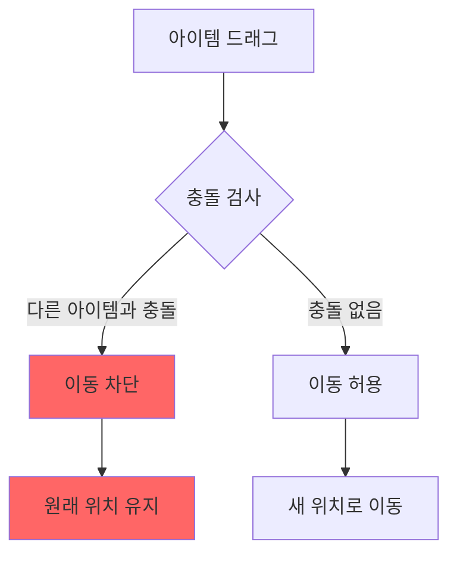
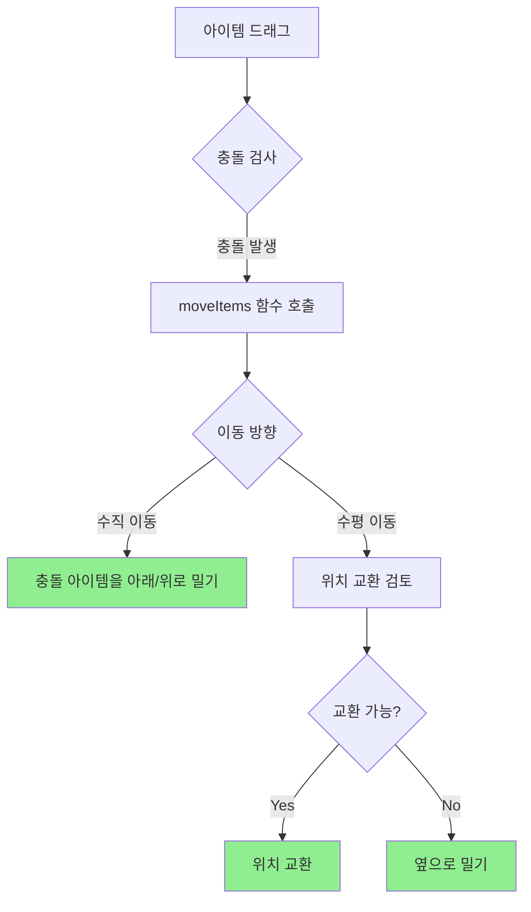

# Prevent Collision 옵션 상세 가이드

## 개요

`preventCollision` 옵션은 그리드 아이템의 충돌 처리 방식을 제어하는 중요한 설정입니다. 이 문서는 해당 옵션의 동작 방식과 사용 시나리오를 상세히 설명합니다.

## 옵션 동작 방식

### preventCollision = true

모든 아이템과의 충돌을 방지합니다. 드래그 중인 아이템이 다른 아이템(static 및 일반)과 충돌하면 이동이 차단됩니다.

```typescript
<GridContainer
  items={items}
  preventCollision={true}
  allowOverlap={false}  // 반드시 false여야 함
>
```

#### 동작 플로우



### preventCollision = false (기본값)

충돌하는 아이템들을 자동으로 밀어내거나 위치를 교환합니다.

```typescript
<GridContainer
  items={items}
  preventCollision={false}  // 기본값
  allowOverlap={false}
>
```

#### 동작 플로우



## 관련 옵션과의 상호작용

### allowOverlap과의 관계

| preventCollision | allowOverlap | 동작 |
|-----------------|--------------|------|
| true | true | allowOverlap 우선, 겹침 허용 |
| true | false | 모든 아이템과 충돌 방지 |
| false | true | allowOverlap 우선, 겹침 허용 |
| false | false | 충돌 시 아이템 밀어내기 |

```typescript
// allowOverlap이 true면 preventCollision 무시됨
if (allowOverlap) {
  // 아이템들이 겹칠 수 있음
  return
}

// allowOverlap이 false일 때만 preventCollision 적용
if (preventCollision) {
  // 모든 아이템과 충돌 방지
} else {
  // 아이템 밀어내기
}
```

## 사용 시나리오

### 1. 대시보드 레이아웃 (preventCollision = true)

고정된 헤더나 사이드바를 보호해야 하는 경우:

```typescript
const dashboardItems = [
  { id: 'header', x: 0, y: 0, w: 12, h: 2, static: true },
  { id: 'sidebar', x: 0, y: 2, w: 3, h: 8, static: true },
  { id: 'widget1', x: 3, y: 2, w: 4, h: 4 },
  { id: 'widget2', x: 7, y: 2, w: 5, h: 4 }
]

<GridContainer
  items={dashboardItems}
  preventCollision={true}
  allowOverlap={false}
>
```

**시각화:**

```
┌────────────────────────────────────────┐
│          Header (Static)               │
├────────┬───────────────────────────────┤
│        │  Widget1    │    Widget2      │
│ Side   │             │                 │
│ bar    ├─────────────┴─────────────────┤
│(Static)│                               │
│        │     이동 가능 영역            │
│        │                               │
└────────┴───────────────────────────────┘
```

### 2. 플렉시블 레이아웃 (preventCollision = false)

사용자가 자유롭게 레이아웃을 재배치할 수 있는 경우:

```typescript
const flexibleItems = [
  { id: 'card1', x: 0, y: 0, w: 4, h: 3 },
  { id: 'card2', x: 4, y: 0, w: 4, h: 3 },
  { id: 'card3', x: 8, y: 0, w: 4, h: 3 }
]

<GridContainer
  items={flexibleItems}
  preventCollision={false}  // 기본값
  allowOverlap={false}
>
```

**동작 예시:**

```
초기 상태:
┌─────┬─────┬─────┐
│  1  │  2  │  3  │
└─────┴─────┴─────┘

Card 1을 오른쪽으로 드래그:
┌─────┬─────┬─────┐
│  2  │  1  │  3  │  (1과 2의 위치 교환)
└─────┴─────┴─────┘
```

## 구현 상세

### 충돌 감지 로직

```typescript
// src/utils/grid.ts
export function checkCollision(
  item1: GridPosition,
  item2: GridPosition
): boolean {
  return !(
    item1.x + item1.w <= item2.x ||  // item1이 item2의 왼쪽
    item2.x + item2.w <= item1.x ||  // item2가 item1의 왼쪽
    item1.y + item1.h <= item2.y ||  // item1이 item2의 위
    item2.y + item2.h <= item1.y     // item2가 item1의 위
  )
}
```

### preventCollision 처리 (GridContainer.tsx)

```typescript
if (preventCollision && !allowOverlap) {
  const collisions = getAllCollisions(tempLayout, { ...draggedItem, ...newPosition })
  
  if (collisions.length > 0) {
    // 이동 차단
    return
  }
}
```

### moveItems 함수 (preventCollision = false)

```typescript
export function moveItems(
  layout: GridItem[],
  item: GridItem,
  cols: number,
  originalItem?: GridItem
): GridItem[] {
  const collisions = getAllCollisions(layout, item)
  
  for (const collision of collisions) {
    if (collision.static) continue  // static 아이템은 이동 불가
    
    // 수직 이동
    if (item.y !== originalItem?.y) {
      collision.y = item.y > originalItem.y 
        ? collision.y + item.h  // 아래로 밀기
        : collision.y - originalItem.h  // 위로 밀기
    }
    
    // 수평 이동 - 위치 교환 검토
    if (shouldSwapItems(item, collision, originalItem)) {
      // 위치 교환 로직
    }
  }
  
  return layout
}
```

## 성능 고려사항

1. **충돌 검사 최적화**
   - 공간 분할 기법 사용 고려 (큰 그리드의 경우)
   - 불필요한 재계산 방지

2. **레이아웃 업데이트**
   - React.memo 사용으로 불필요한 리렌더링 방지
   - 레이아웃 변경 시만 콜백 호출

## 모범 사례

### ✅ 권장 사항

1. **정적 요소가 있는 경우**
   ```typescript
   preventCollision={true}
   allowOverlap={false}
   ```

2. **자유로운 레이아웃**
   ```typescript
   preventCollision={false}  // 기본값
   allowOverlap={false}
   ```

3. **특수한 경우 - 레이어 시스템**
   ```typescript
   preventCollision={false}
   allowOverlap={true}  // 겹침 허용
   ```

### ❌ 피해야 할 패턴

1. **모순된 설정**
   ```typescript
   // preventCollision은 무시됨
   preventCollision={true}
   allowOverlap={true}
   ```

2. **불필요한 static 남용**
   ```typescript
   // 모든 아이템이 static이면 의미 없음
   items.map(item => ({ ...item, static: true }))
   ```

## 문제 해결

### 아이템이 예상대로 움직이지 않을 때

1. `allowOverlap` 설정 확인
2. static 아이템 위치 검토
3. 컨테이너 경계 설정 확인 (`isBounded`)

### 성능 이슈

1. 아이템 수가 많은 경우 가상화 고려
2. 레이아웃 변경 콜백 최적화
3. 불필요한 애니메이션 제거

## 마이그레이션 가이드

### React Grid Layout에서 마이그레이션

```typescript
// React Grid Layout
<ReactGridLayout
  preventCollision={true}
  compactType={null}
>

// Tailwind Grid Layout (동일한 동작)
<GridContainer
  preventCollision={true}
  compactType={null}
  allowOverlap={false}
>
```

## 참고 자료

- [React Grid Layout - Prevent Collision](https://github.com/react-grid-layout/react-grid-layout#preventcollision-boolean)
- [Grid Layout Algorithms](https://en.wikipedia.org/wiki/Bin_packing_problem)
- [AABB Collision Detection](https://developer.mozilla.org/en-US/docs/Games/Techniques/2D_collision_detection)