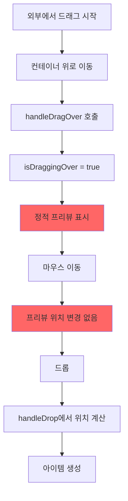
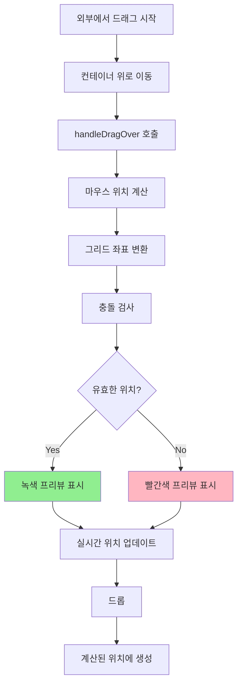

# 문제 분석: DroppableGridContainer 실시간 추적

## 문제 설명

DroppableGridContainer가 외부에서 드래그되는 아이템의 위치를 실시간으로 추적하지 못하고, 드롭 시점에만 위치를 계산합니다. 이로 인해 사용자는 아이템이 어디에 놓일지 예측할 수 없습니다.

## 현재 구현 분석

### 1. 현재 DroppableGridContainer 구조 (DroppableGridContainer.tsx)

```typescript
export function DroppableGridContainer({
  onDrop,
  droppingItem = { w: 2, h: 2 },
  className,
  ...props
}: DroppableGridContainerProps) {
  const [isDraggingOver, setIsDraggingOver] = useState(false)
  
  const handleDragOver = (e: React.DragEvent) => {
    e.preventDefault()
    if (e.dataTransfer) {
      e.dataTransfer.dropEffect = 'copy'
    }
    setIsDraggingOver(true)  // 단순히 플래그만 설정
  }
  
  // 드롭 시점에만 위치 계산
  const handleDrop = (e: React.DragEvent) => {
    // ... 위치 계산 로직
  }
}
```

### 2. 현재 동작 플로우



### 3. 드롭 위치 계산 로직

```typescript
// handleDrop 함수 내부
const relativeX = e.clientX - rect.left
const relativeY = e.clientY - rect.top

const gridX = Math.floor(relativeX / cellWidth)
const gridY = Math.floor(relativeY / cellHeight)

const newItem: GridItem = {
  id: droppedData.id || `dropped-${Date.now()}`,
  x: Math.max(0, Math.min(gridX, cols - (droppingItem.w || 2))),
  y: Math.max(0, gridY),
  w: droppingItem.w || 2,
  h: droppingItem.h || 2,
  ...droppedData,
}
```

### 4. 문제점 분석

| 현재 상태 | 문제점 | 영향 |
|----------|--------|------|
| 정적 프리뷰 | 드롭 위치 예측 불가 | UX 저하 |
| 드롭 시점 계산 | 실시간 피드백 없음 | 사용성 문제 |
| 충돌 검사 없음 | 유효하지 않은 위치에도 드롭 가능 | 레이아웃 깨짐 |
| 그리드 스냅 없음 | 정확한 위치 맞추기 어려움 | 정밀도 부족 |

## 근본 원인

1. **상태 관리 설계 부족**
   - 마우스 위치를 추적하는 상태가 없음
   - GridContainer와의 통신 채널 부재

2. **이벤트 처리 불완전**
   - onDragOver에서 위치 계산을 하지 않음
   - throttling 없이 구현 시 성능 문제 우려

3. **컴포넌트 간 결합도**
   - DroppableGridContainer와 GridContainer가 느슨하게 연결됨
   - 프리뷰 위치 정보 전달 메커니즘 없음

## 해결 방안

### 1. 마우스 위치 추적 상태 추가

```typescript
interface DragPreviewState {
  x: number
  y: number
  isValid: boolean
}

const [previewState, setPreviewState] = useState<DragPreviewState | null>(null)
```

### 2. 실시간 위치 계산 (throttled)

```typescript
import { throttle } from '../utils/throttle'

const calculateGridPosition = useCallback((e: React.DragEvent) => {
  const rect = containerRef.current?.getBoundingClientRect()
  if (!rect) return null
  
  const containerPadding = props.containerPadding || [16, 16]
  const cols = props.cols || 12
  const rowHeight = props.rowHeight || 60
  const gap = props.gap || 16
  
  // 마우스 위치를 그리드 좌표로 변환
  const relativeX = e.clientX - rect.left - containerPadding[0]
  const relativeY = e.clientY - rect.top - containerPadding[1]
  
  const cellWidth = (rect.width - containerPadding[0] * 2 + gap) / cols
  const cellHeight = rowHeight + gap
  
  const gridX = Math.floor(relativeX / cellWidth)
  const gridY = Math.floor(relativeY / cellHeight)
  
  // 경계 체크
  const x = Math.max(0, Math.min(gridX, cols - (droppingItem.w || 2)))
  const y = Math.max(0, gridY)
  
  return { x, y }
}, [props.cols, props.rowHeight, props.gap, props.containerPadding, droppingItem])

const handleDragOver = useMemo(
  () => throttle((e: React.DragEvent) => {
    e.preventDefault()
    
    const position = calculateGridPosition(e)
    if (!position) return
    
    // 충돌 검사
    const previewItem = {
      id: 'preview',
      x: position.x,
      y: position.y,
      w: droppingItem.w || 2,
      h: droppingItem.h || 2
    }
    
    const isValid = !checkCollision(props.items, previewItem)
    
    setPreviewState({
      x: position.x,
      y: position.y,
      isValid
    })
    setIsDraggingOver(true)
  }, 16), // 60fps
  [calculateGridPosition, props.items, droppingItem]
)
```

### 3. GridContainer와의 통합 개선

```typescript
// DroppableGridContainer
<GridContainer 
  {...props} 
  droppingItem={
    isDraggingOver && previewState
      ? {
          ...droppingItem,
          previewX: previewState.x,
          previewY: previewState.y,
          isValid: previewState.isValid
        }
      : undefined
  }
  isExternalDragging={isDraggingOver}
/>
```

### 4. 시각적 피드백 강화

```typescript
// GridContainer의 프리뷰 렌더링
const previewClassName = cn(
  "absolute border-2 border-dashed rounded opacity-75 pointer-events-none flex items-center justify-center transition-all duration-150",
  droppingItem?.isValid 
    ? "bg-green-200 border-green-400" 
    : "bg-red-200 border-red-400"
)

// 그리드 라인 표시 (선택적)
{showGridLines && isDraggingOver && (
  <GridLines cols={cols} rowHeight={rowHeight} gap={gap} />
)}
```

### 5. 드래그 데이터 처리 개선

```typescript
// 드래그 가능한 아이템 컴포넌트
const DraggableItem = ({ size, children }) => {
  const handleDragStart = (e: React.DragEvent) => {
    const data = {
      w: size.w,
      h: size.h,
      type: 'grid-item'
    }
    e.dataTransfer.setData('application/json', JSON.stringify(data))
    e.dataTransfer.effectAllowed = 'copy'
  }
  
  return (
    <div draggable onDragStart={handleDragStart}>
      {children}
    </div>
  )
}
```

## 구현 순서

1. ✅ throttle 유틸리티 구현 또는 import
2. ✅ DroppableGridContainer에 마우스 추적 로직 추가
3. ✅ 실시간 충돌 검사 구현
4. ✅ GridContainer와의 통합 개선
5. ✅ 시각적 피드백 구현
6. ✅ 성능 최적화 및 메모리 누수 방지
7. ✅ 테스트 케이스 작성

## 예상 결과

### 개선된 플로우



## 성능 고려사항

1. **Throttling**
   - dragOver 이벤트는 매우 자주 발생
   - 16ms (60fps) 간격으로 제한

2. **메모이제이션**
   - 계산 함수들을 useCallback으로 감싸기
   - 불필요한 재계산 방지

3. **클린업**
   - 컴포넌트 언마운트 시 이벤트 리스너 정리
   - 메모리 누수 방지

## 테스트 시나리오

1. 외부 아이템 드래그 시 실시간 프리뷰 표시
2. 마우스 이동에 따른 프리뷰 위치 업데이트
3. 충돌 시 빨간색 프리뷰 표시
4. 유효한 위치에서 녹색 프리뷰 표시
5. 드롭 시 예상 위치에 정확히 생성
6. 60fps 성능 유지 확인
7. 컨테이너 경계 처리 확인